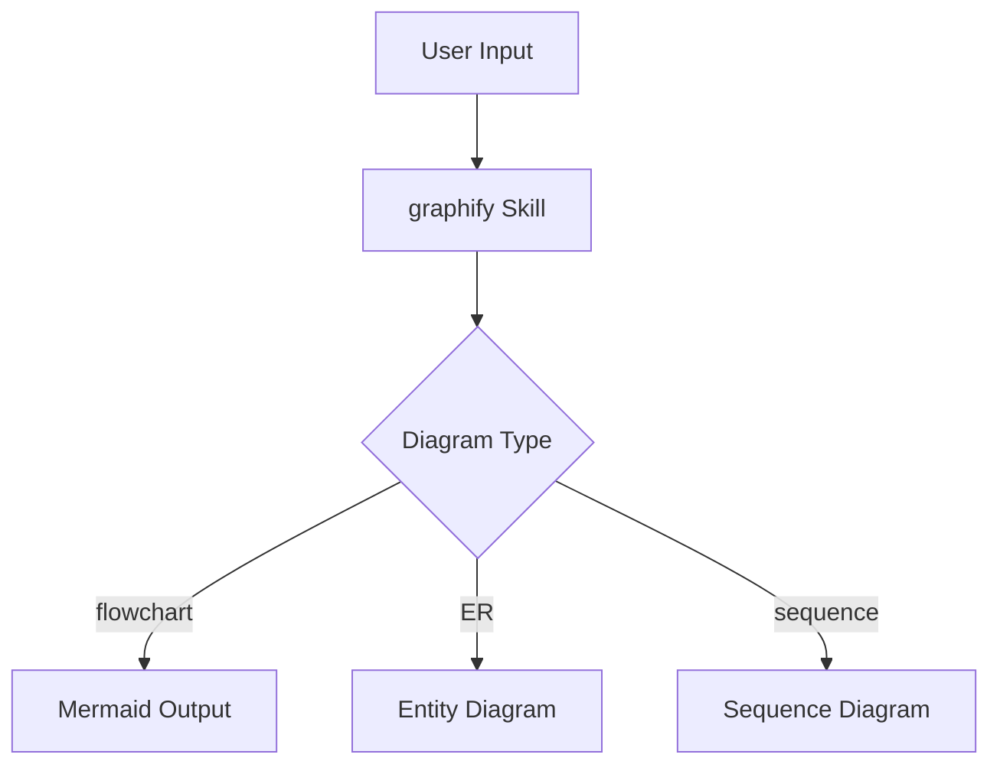

# Graphify 스킬 설치 (Claude Code)

## 📌 Context
Claude Code는 `/skill` 명령어를 통해 커스텀 스킬을 확장할 수 있다. `graphify` 스킬은 데이터나 구조를 시각적 그래프(다이어그램)로 변환해주는 기능을 제공하며, 복잡한 관계·흐름·아키텍처를 빠르게 시각화할 때 유용하다. 스킬을 설치하면 Claude Code 세션 내에서 `/graphify` 명령으로 즉시 호출할 수 있다.

## ⚙️ Core

### 1. 스킬 설치 명령어
```bash
# Claude Code CLI에서 직접 설치
claude skill install graphify
```

### 2. settings.json을 통한 수동 등록
```json
// ~/.claude/settings.json
{
  "skills": [
    {
      "name": "graphify",
      "description": "데이터 구조나 관계를 Mermaid/Graphviz 다이어그램으로 시각화",
      "command": "graphify"
    }
  ]
}
```

### 3. 설치 확인 및 사용
```bash
# 설치된 스킬 목록 확인
claude skill list

# 스킬 호출 예시
/graphify <대상 코드 또는 구조 설명>
```

### 4. Mermaid 다이어그램 출력 예시


## 💡 Insight
- Claude Code 스킬은 프롬프트 래퍼(wrapper) 방식으로 동작하므로 설치 후 별도 런타임 의존성이 없다.
- graphify는 코드 리뷰, 아키텍처 문서화, 데이터 흐름 파악 등 시각화가 필요한 모든 맥락에서 활용 가능하다.
- Mermaid 기반 출력은 GitHub README, Notion, Obsidian 등 대부분의 마크다운 렌더러에서 바로 렌더링된다.
- 단점: 복잡도가 높은 그래프는 노드 수 제한이나 레이아웃 충돌이 발생할 수 있으므로, 큰 시스템은 서브그래프로 분리하는 것이 권장된다.